# Star Map Visualization Diagrams

Visual representations of the three starmap concepts using Mermaid diagrams.

---

## Concept 1: Radial Sphere of Influence

### Structure Diagram


### Data Flow


---

## Concept 2: Regional Cluster Map

### Galaxy Structure


### Zoom Level Interaction


### Sector Assignment Algorithm


---

## Concept 3: Tactical Filter with Mini-Map

### UI Layout


### Filter Mode Behavior


### Rendering Pipeline


---

## Data Structures

### Concept 1: Sphere of Influence

```typescript
interface SphereOfInfluence {
  center: {
    empire: Empire;
    position: { x: 450, y: 300 };  // Fixed center
  };

  immediate: {
    empires: Empire[];               // 3-5 neighbors
    radius: 150;                     // px from center
    attackCost: 1.0;                 // Normal cost
    style: 'full_detail';            // Render mode
  };

  distant: {
    empires: Empire[];               // 5-10 neighbors
    radius: 300;                     // px from center
    attackCost: 2.0;                 // Double forces needed
    style: 'grayed_reduced';         // Render mode
  };

  hidden: {
    empires: Empire[];               // Rest (not rendered)
    attackable: false;               // Cannot attack
  };

  wormholes: {
    connections: Array<{
      from: EmpireId;
      to: EmpireId;
      type: 'natural' | 'constructed';
      attackCost: 1.5;               // 50% penalty
    }>;
  };
}
```

### Concept 2: Regional Sectors

```typescript
interface GalaxySector {
  id: string;                        // "sector-a"
  name: string;                      // "Outer Rim"
  empires: Empire[];                 // 10 empires per sector
  position: { x: number, y: number }; // Sector box position

  connections: SectorConnection[];
}

interface SectorConnection {
  toSectorId: string;
  type: 'natural_border' | 'wormhole';
  attackCostModifier: number;        // 1.0 = same, 1.2 = border, 1.5 = wormhole
}

// Database schema additions needed:
// ALTER TABLE empires ADD COLUMN sector_id VARCHAR;
// CREATE TABLE sector_connections (
//   id UUID PRIMARY KEY,
//   from_sector_id VARCHAR NOT NULL,
//   to_sector_id VARCHAR NOT NULL,
//   connection_type VARCHAR NOT NULL,
//   attack_cost_modifier DECIMAL DEFAULT 1.0
// );
```

### Concept 3: Filter Modes

```typescript
interface MapViewState {
  filterMode: 'immediate' | 'expanded' | 'galaxy';

  visibleEmpires: {
    immediate: Empire[];             // Always shown (3-5)
    expanded: Empire[];              // Shown in expanded mode (15-20)
    all: Empire[];                   // Shown in galaxy mode (100)
  };

  renderConfig: {
    useForceSimulation: boolean;     // false for immediate, true for others
    simulationStrength: number;      // -150 expanded, -50 galaxy
    nodeDetailLevel: 'high' | 'medium' | 'low';
  };

  uiState: {
    selectedEmpire: EmpireId | null;
    pinnedThreats: EmpireId[];       // Always show these
    showWormholes: boolean;
  };
}
```

---

## Performance Comparison

```mermaid
graph LR
    subgraph "Concept 1: Radial"
        C1Nodes[5-15 nodes]
        C1Sim[NO simulation]
        C1Render[Full rendering]
        C1FPS[60 FPS ✅]
    end

    subgraph "Concept 2: Regional"
        C2Nodes[10-15 nodes]
        C2Sim[NO simulation]
        C2Render[Full rendering]
        C2FPS[60 FPS ✅]
    end

    subgraph "Concept 3: Immediate Mode"
        C3INodes[5-10 nodes]
        C3ISim[NO simulation]
        C3IRender[Full rendering]
        C3IFPS[60 FPS ✅]
    end

    subgraph "Concept 3: Expanded Mode"
        C3ENodes[15-20 nodes]
        C3ESim[Light D3 simulation]
        C3ERender[Full rendering]
        C3EFPS[50-60 FPS ✅]
    end

    subgraph "Concept 3: Galaxy Mode"
        C3GNodes[100 nodes]
        C3GSim[Optimized D3 simulation]
        C3GRender[Simplified rendering]
        C3GFPS[30-40 FPS ⚠️]
    end

    subgraph "Current Implementation"
        CurrNodes[25-100 nodes]
        CurrSim[Full D3 simulation]
        CurrRender[Full rendering]
        CurrFPS[20-30 FPS ⚠️<br/>+ Jittering bug]
    end

    style C1FPS fill:#10b981
    style C2FPS fill:#10b981
    style C3IFPS fill:#10b981
    style C3EFPS fill:#10b981
    style C3GFPS fill:#f59e0b
    style CurrFPS fill:#ef4444
```



---

## Implementation Complexity


**Total Estimated Effort:**
- Concept 1: **3 days** ✅ (Recommended for MVP)
- Concept 2: **8-9 days** (For MMO vision)
- Concept 3: **6-7 days** (Best long-term)
- Quick Fix: **0.5 days** (Band-aid solution)

---

## User Experience Flow

### Concept 1: Radial Flow


### Concept 2: Regional Flow


### Concept 3: Filter Flow


---

## Decision Matrix

| Criteria | Weight | Concept 1 | Concept 2 | Concept 3 |
|----------|--------|-----------|-----------|-----------|
| **Fixes jittering** | 🔴 Critical | ✅ 10/10 | ✅ 10/10 | ⚠️ 7/10 |
| **Implementation speed** | 🔴 Critical | ✅ 9/10 | ❌ 4/10 | ⚠️ 6/10 |
| **Handles 100 empires** | 🟠 High | ✅ 8/10 | ✅ 10/10 | ✅ 9/10 |
| **Sphere of influence** | 🟠 High | ✅ 10/10 | ⚠️ 7/10 | ✅ 9/10 |
| **Strategic depth** | 🟡 Medium | ⚠️ 6/10 | ✅ 10/10 | ⚠️ 7/10 |
| **Visual appeal** | 🟡 Medium | ⚠️ 6/10 | ✅ 9/10 | ✅ 8/10 |
| **Player control** | 🟢 Low | ❌ 4/10 | ✅ 8/10 | ✅ 9/10 |
| **"Galaxy" feel** | 🟢 Low | ❌ 3/10 | ✅ 10/10 | ⚠️ 7/10 |
| | **Total** | **56/80** | **68/80** | **62/80** |

**Winner for MVP**: Concept 1 (fastest, solves critical issues)
**Winner for MMO**: Concept 2 (best for 100+ players)
**Winner for polish**: Concept 3 (best UX, player control)

---

*Document created: 2025-12-30*
*See STARMAP-VISUALIZATION-CONCEPTS.md for detailed descriptions*
